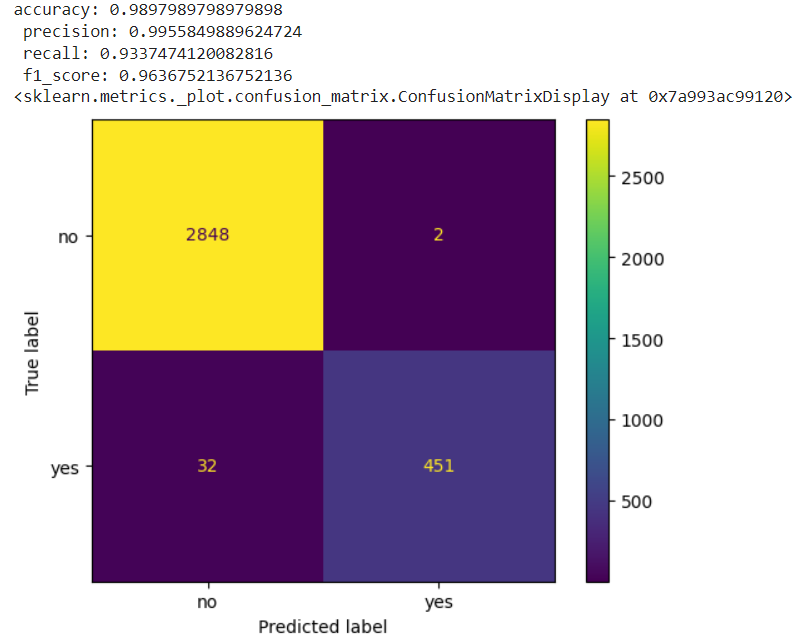
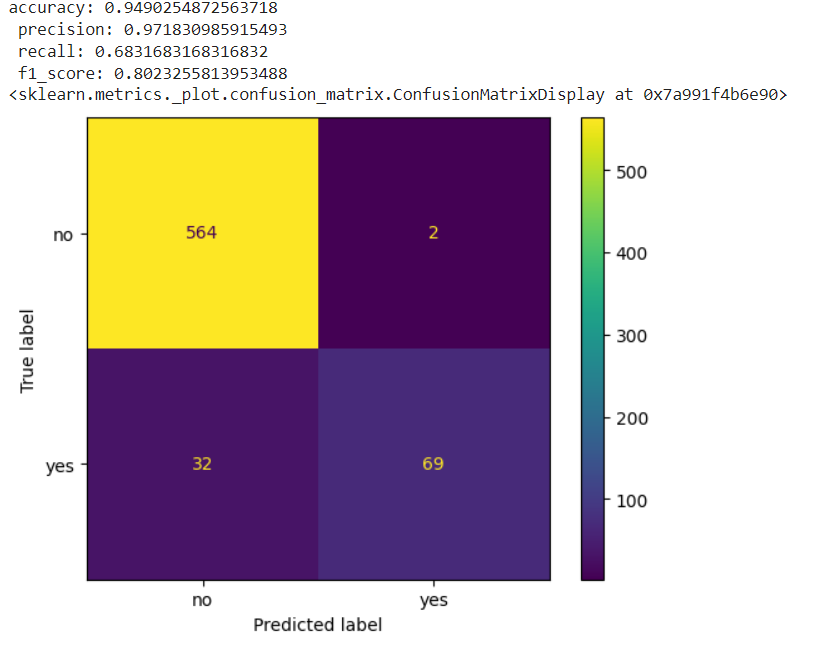
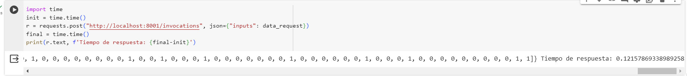
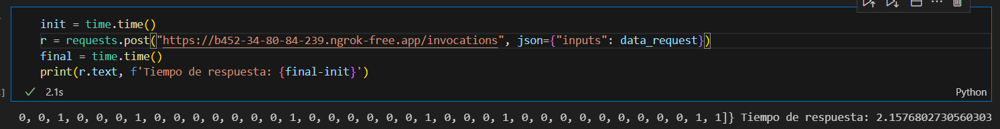

# Informe de salida

## Resumen Ejecutivo

Este informe describe los resultados del proyecto de machine learning y presenta los principales logros y lecciones aprendidas durante el proceso.

## Resultados del proyecto

### Resumen de los entregables y logros alcanzados en cada etapa del proyecto.
- Entregable 1. Entendimiento del negocio y carga de datos. 
    El proyecto se estructura desde el entregable 1: /docs/businnes_understanding, para trabajar con un dataset de pruebas de Kaggle y determinar el churn que puede ocurrir en un empresa de telecomunicaciones. Con el dataset se obtiene una idea general de que datos se usan para predecir la variable objetivo (binaria) y poder aplicarlo en una empresa real. Se obtiene que las variables mas significativas son Las llamadas a servicio al cliente, el plan internacional, los minutos consumidos en el dia y su tarifa.
- Entregable 2. Preprocesamiento y analisis exploratorio de los datos.
    Al realizar un analisis exploratorio de los datos  en /docs/data: Se encuentra desbalanceo de clases, rangos de valores diferentes entre columnas, variables fuertemente correlacionadas y variables que no permiten generalizar el dataset. Durante este proceso se eliminan las variables correlacionadas y las que son descriptoras unicas de cada registro, se normalizan los valores de las columnas y el desbalanceo de clases se mantiene dentro del dataset.
- Entregable 4. Modelamiento y extracción de caracteristicas.
    En docs/modeling se expone la selección de un modelo base RandomForestClassifier con hiperparametros por defecto que trae la libreria scikit learn y luego se compara contra el mismo modelo pero haciendo una optimización de la maximización de la metrica F1 Score ajustando los hiperparametros: n_estimators, criterion, max_depth, max_features, random_state, class_weight con optuna.
    Se encuentra que el modelo mejoro en un 2% la metrica de F1 Score y en 3% la precisión en comparación al modelo base, obteniendo como resultado un f1 score del 78%.
- Entregable 5. Despliegue. 
    Debido a que todo el proyecto se manejo desde las metodologias agiles y tambien con un rol de MLOps, desde docs/deployment se muestra una arquitectura que despliega el modelo final en MLFlow. Esta herramienta es la que permitirá registrar los experimentos realizados para dar solución al problema de negocio y cuando se seleciona el modelo final este pueda ser consumido por una aplicación que implemente la compañia mediante API REST.
- Entregable 6. Evaluación del modelo y entrega final.
    Una vez desplegado el modelo se valida el consumo del mismo mediante API REST y el tiempo de respuesta cuando se le envia un listado de 1000 clientes con sus caracteristicas.

### Evaluación del modelo final y comparación con el modelo base.

#### Evaluación metricas del modelo

    Se utiliza todo el dataset para que el modelo final prediga la variable objetivo encontrando que de 483 registros de la clase positiva 32 se clasificaron mal mientras que de la clase negativa solo se clasificaron 2 erroneamente.
    El F1 Score aumenta significativamente sin embargo puede deberse a un sobreajsute en el modelo con los datos de entrenamiento y tambien al significativo desbalance de los datos (Metrica que demuestra el recall obtenido con los datos del set de pruebas explicado en docs/modeling)
    
    - Resultados sobre todo el dataset:
    

    - Resultados sobre el dataset de pruebas:
    
    
#### Evaluación de desempeño API
    Se evalua que el modelo una vez puesto en producción, pueda ser consumido mediante un API REST de un equipo cliente. Se prueba haciendo una petición POST con 1000 clientes (cada uno con un vector de 12 caracteristicas) El tiempo de respuesta del API corriendo en una maquina de google colab fue de 0.125 segundos accediendo localmente (Dentro de la misma red)
     

    Por otra parte se obtuvo una metrica de 2.157 segundos al acceder a MLFLow en la maquina de colab mediante NGROK desde un equipo personal conectado a internet.

    
    Aunque lo anterior fue una prueba de concepto (No se realizó el despliegue sobre maquinas propiamente destinadas para las tareas descritas) los tiempos de respuesta son aceptables para la tarea descrita en /docs/deployment/ que realizará el ERP-CRM.

- Descripción de los resultados y su relevancia para el negocio.

Al evaluar el modelo con el dataset completo, las cifras son por encima del 90%, lo cual es un resultado superior al obtenido con el set de pruebas. Sin embargo una hipotesis a evaluar es que exista sobre ajuste durante el entrenamiento y por ello el modelo tiene un desempeño mas bajo al predecir el churn con los datos de prueba.
Por otra parte desde el principio del proyecto se evidencio el desbalanceo de clases, esto puede impactar en la inclinación que tiene el modelo por clasificar mejor la clase megativa.

Ademas, Se puede validar que las variables empleadas durante el proyecto son relevantes para realizar la tarea de predicción de churn con machine learning, sin embargo temas como el desbalanceo de clases o sobreajuste se deben seguir trabajando para mejorar las metricas.

Por otra parte, aunque el modelo se desplegó en una maquina que no esta pensada para esta tarea, se obtuvieron consumos satisfactorios del API desde otra maquina que no estaba en la misma red, y que ademas debido a la gran cantidad de datos que se envio en una petición el tiempo de respuesta fue menor a 2.2 seg por fuera de la red (a traves de internet) y localmente el tiempo de respuesta fue menor a 0.2 seg

## Lecciones aprendidas

- Se pudo validar como las caracteristicas de este dataset pueden ser extrapoladas a una compañia real para realizar la misma tarea. En este caso en particular, mediante la matriz de correlación se evidencian las variables mas relevantes a tener en cuenta al querer replicar el proyeto y sus resultados.
- Es importante solo dejar las variables exogenas mas discriminantes del dataset para que el modelo logre generalizar mejor sus predicciones, esto se comprobo mediante la correlación de variables.
- El escalado de magnitudes en los datos es importante ya que como se evidencio en el proyecto hay outliers o variables con una magnitud significativamente mas grande que otras y esto puede sesgar las predicciones del modelo. 
- El labor de la selección de hiperparametros es importante y con herramientas como optuna esta tarea se puede llevar a cabo de manera agil para lograr mejorar las metricas del modelo. En esta caso se obtuvieron mejoras de hasta el 3%.
- Desplegar el modelo en producción y mantenerlo en el tiempo es fundamental en estos proyectos, ya que aunque no se realizaron pruebas de drifting en los datos, en el mundo real esto ocurre y debemos contar con herramientas como MLFLow que permitan que el labor MLOps se pueda realizar de manera agil. 
- El desbalanceo de datos y el sobreajuste son importantes al momento de querer crear un modelo con el mas alto potencial, estas variables juegan un papel importante en un proceso de ciencia de datos. 

## Impacto del proyecto

- Este proyecto es importante dentro de una compañia ya que puede asegurar la permanencia o fidelización de sus clientes aplicando estrategias comerciales para asi sobresalir ante la competencia. Es común que un cliente deje de contratar o pagar por los servicios/productos de la empresa y las estrategias por retenerlo se generen una vez el nos informa de su decisión. Un modelo como el que se entrenó puede ayudar a que estas estrategias se generen de forma proactiva, que aquellos patrones del cliente se identifiquen a tiempo y puedan ayudar a la organización a suministrarle aquellas mejoras que el espera o que puedan mantener su fidelidad en el tiempo.
- Aunque lo anterior es el objetivo ideal, es importante resaltar que para la ejecución de este proyecto se utilizó un dataset de pruebas de Kaggle y que el resultado del mismo solo da la guia de lograr aplicar este proyecto en una empresa de telecomunicaciones sus propias variables. Por tanto el trabajo a futuro es replicar esto mismo y garantizar que los resultados sean iguales o superiores.
Esto beneficiara transversalmente a la compañia ya que cada una de las áreas cada vez encontrará mejores estrategias para evitar el churn y atraer mas clientes. 
## Conclusiones

- Se concluye que dentro de un proyecto de ciencia de datos es fundamental el rol de MLOps, ya que esto nos garantizará que el ciclo de vida del proyecto se mantenga en el tiempo, con herramientas para el versionado de codigo, de datos, de modelos, drifting, tunning, etc se puede lograr dicha tarea.
- Se concluye que, aunque dentro del ambito academico y de experimentación se usan los notebooks de python, en el mundo real debemos desplegar nuestros modelos de forma escalable y mantenible en el tiempo de tal manera de que la puesta en producción del modelo contemple infraestructura de hardware y software. 
- Se concluye que como cientificos de datos, las metricas de la exactitud del modelo es algo que constantemente estamos evaluando y buscamos mejorar, pero no podemos dejar de lado las metricas que van más allá de lo tecnico como los objetivos de negocio, la experiencia de usuario, y el comportamiento de nuestros modelos en el tiempo.   
- Se concluye que, aunque se obtuvieron metricas superiores en promedio al 80%, se pudo evidenciar en el recall y en el analisis exploratorio de los datos la existencia de desbalanceo de clases dentro del dataset que impactan el rendimiento final, ademas que generó sobreajuste en la clasificación de la clase positiva. 
- Se concluye, que es posible desplegar un modelo similar en una empresa del sector de telecomunicaciones, ya que como se evidencio en el apartado de preprocesamiento y exploración de datos, variables como el plan contratado, llamadas a servicio al cliente, cargos por minutos consumidos pueden ser discriminantes para una tarea de prediccion de churn.
- Se concluye que con herramientas como MLFlow, podemos realizar parte del trabajo de MLOps, y que gracias a su capa API es sencillo realizar multiples pruebas y poner en produccción en pocos pasos nuestros modelos preparados para ser consumidos por un cliente final.

## Agradecimientos

- Agradezco a mi familia por el apoyo constante e incondicional durante el tiempo que llevo formandome en este campo que tanto me apasiona. A los tutores y profesores del diplomado de Machine Learning Avanzado de la Universidad Nacional de Colombia por su dispocisión y apoyo durante el aprendizaje y ejecución de este y otros multiples proyectos.  