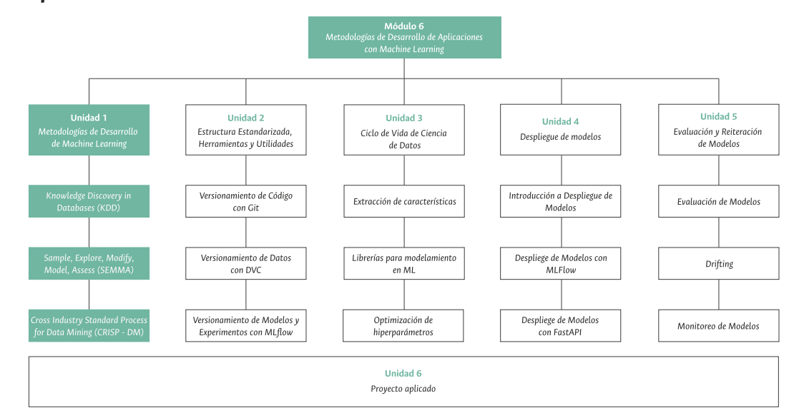
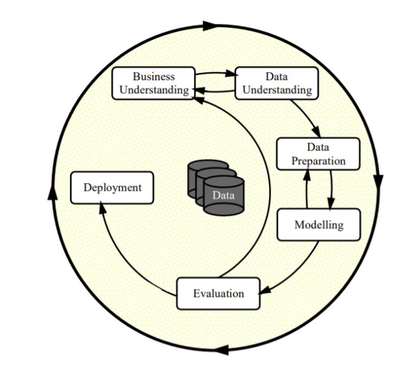

# Project Charter - Entendimiento del Negocio

## Nombre del Proyecto

CHURN PREDICTION - KAGGLE TELCOM DATASET

## Objetivo del Proyecto

Aplicar MLOps en la predicción del churn de los clientes (variable endogena) dada las variables 
exogenas contenidas en la base de datos de una empresa de telecomunicaciones usada en un DataCamp.  

Dado el dataset de Kagle https://www.kaggle.com/datasets/nushkaa/telecom-customer-churn/data, este se utilizará para reforzar el
aprendizaje adquirido en el módulo 6 de MLDS, adicional de implementar metódologias de Machine Learning Operations que permitan dar solución al churn que existe en las 
compañias de telecomunicaciones por parte de los clientes. Una vez adquirido el aprendizaje con estos datos de prueba, el proyecto a largo plazo es implementarlo con los datos
de una compañia colombiana de este sector. 
## Alcance del Proyecto

### Descripción de los datos disponibles:
- El dataset de Kaggle contiene datos de clientes de telecomunicaciones adquiridos por el usuario Nushkaa durante un DataCamp. En total son 21 columnas y 3333 registros
Sus columnas son:

| Campo | Traducción | Tipo de dato |
|---|---|---|
| Account Length | Duración de la cuenta | Número entero |
| Vmail Message | Mensaje de voz | Número entero |
| Day Mins | Minutos de día | Número real |
| Eve Mins | Minutos de noche | Número real |
| Night Mins | Minutos de noche | Número real |
| Intl Mins | Minutos internacionales | Número real |
| CustServ Calls | Llamadas al servicio de atención al cliente | Número entero |
| Churn | Cuota de abandono | Texto |
| Intl Plan | Plan internacional | Texto |
| Vmail Plan | Plan de correo de voz | Texto |
| Day Calls | Llamadas de día | Número entero |
| Day Charge | Cargo de llamadas de día | Número real |
| Eve Calls | Llamadas de noche | Número entero |
| Eve Charge | Cargo de llamadas de noche | Número real |
| Night Calls | Llamadas de noche | Número entero |
| Night Charge | Cargo de llamadas de noche | Número real |
| Intl Calls | Llamadas internacionales | Número entero |
| Intl Charge | Cargo de llamadas internacionales | Número real |
| State | Estado | Texto |
| Area Code | Código de área | Número entero |
| Phone | Teléfono | Número de teléfono |

- Se espera implementar modelos de Machine Learning que clasifiquen el churn de un cliente mediante la metódologia CRISP-DM y adicional aplicar las tecnicas de ML-Operations vistas en el curso de MLDS6: 

- Para definir si el proyecto tuvo exito, deberá Evidenciar: La metodologia selecionada, el manejo de versiones de cada uno de los componentes del proyecto, su ciclo de vida, el despliegue y finalmente su evaluación. 

## Metodología
CRISP-DM, SEMMA y KDD son todas metodologías de ciencia de datos que se pueden utilizar para proyectos de predicción de churn. Sin embargo, CRISP-DM tiene varias ventajas que la hacen una mejor opción para este tipo de proyectos.

### Ventajas de CRISP-DM
- **Enfoque iterativo:** CRISP-DM es un enfoque iterativo, lo que significa que el proceso de desarrollo se repite hasta que se alcanza un objetivo satisfactorio. Esto es importante para proyectos de predicción de churn, ya que los datos y los modelos pueden cambiar constantemente.
- **Foco en la comunicación:** CRISP-DM enfatiza la comunicación entre los diferentes participantes en el proyecto, incluidos los científicos de datos, los gerentes de negocio y los clientes. Esto es importante para garantizar que el proyecto se desarrolle de acuerdo con las necesidades de los clientes y que los resultados sean útiles.
- **Facilidad de uso:** CRISP-DM es una metodología relativamente sencilla de seguir. Esto la hace una buena opción para proyectos de predicción de churn, que a menudo tienen plazos ajustados y presupuestos limitados.

## Cronograma

| Tarea | Fecha |
|------|---------|
| Entendimiento del negocio, carga de datos y creacion del repositorio | del 8 de noviembre al 14 de noviembre |
| Extracción de características, Analisis exploratorio de los datos | del 15 de noviembre al 21 de noviembre |
| Modelamiento y despliegue MLFlow | del 22 de noviembre al 28 de noviembre |
| Evaluación y reiteración (Si lo requiere) | del 28 de noviembre al 5 de diciembre |
| Video y entrega final | del 6 de diciembre al 8 de diciembre |

## Equipo del Proyecto

- Brayan Andrés Prado Casiano - Lider del proyecto

## Presupuesto

No hay un presupuesto económico, solo hora/labor del equipo.  

## Stakeholders

- No hay aún stakeholders