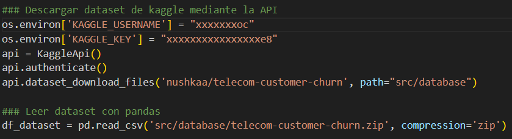

# Definición de los datos

## Origen de los datos

- Los datos se encuentran en el siguiente repositorio de Kaggle: https://www.kaggle.com/datasets/nushkaa/telecom-customer-churn/data 
para obtenerlos se utiliza la libreria de Kaggle para python: https://github.com/Kaggle/kaggle-api, la cual permite obtener datasets por medio de su API. Este repositorio pertenece al usuario Nushkaa el cual informa que los datos fueron obtenidos de un Datacamp.

## Especificación de los scripts para la carga de datos

- En /scripts/data_acquisition/main.py se encuentra la lógica para adquirir los datos del dataset y cargarlos en memoria para su procesamiento.
Debido a que mediante la API de Kaggle se puede descargar el archivo desde el repositorio, este archivo se obtiene en extensión .zip el cual contiene un documento con formato csv. Para leer los datos se usa la libreria Pandas y se usa: df_dataset = pd.read_csv('src/database/telecom-customer-churn.zip', compression='zip') esta función permite leer el csv contenido en un zip al pasarle el parametro  compression='zip' 

## Referencias a rutas o bases de datos origen y destino

- El origen de los datos es https://www.kaggle.com/datasets/nushkaa/telecom-customer-churn/data , los cuales seran almacenados en disco en la ruta /src/database (anteriormente se almacenaba en la ruta /data)

### Rutas de origen de datos

- Datos de origen: https://www.kaggle.com/datasets/nushkaa/telecom-customer-churn/data
- Su estructura es telecom-customer-churn.zip/churn.csv
- El preprocesamiento inicial es validar que no existan registros nulos

### Base de datos de destino

- Durante el preprocesamiento la data se procesa en memoria 
- Finalizado el preprocesamiento la data se guardara en /src/preprocesing
