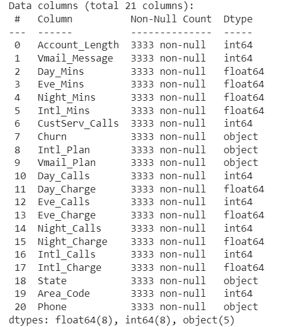
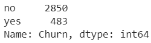
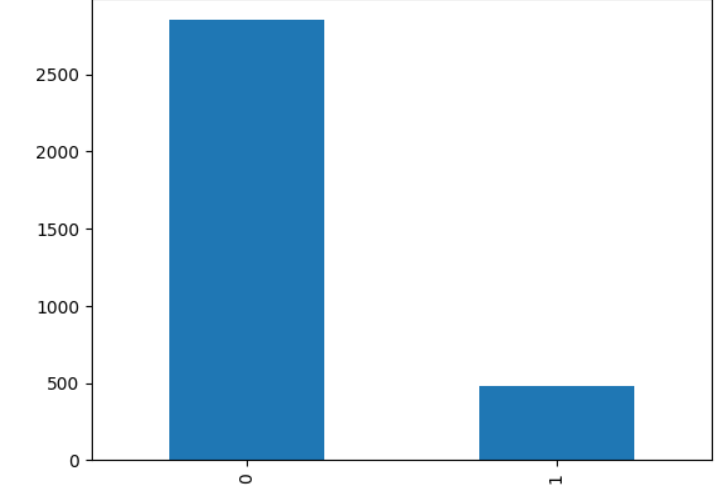
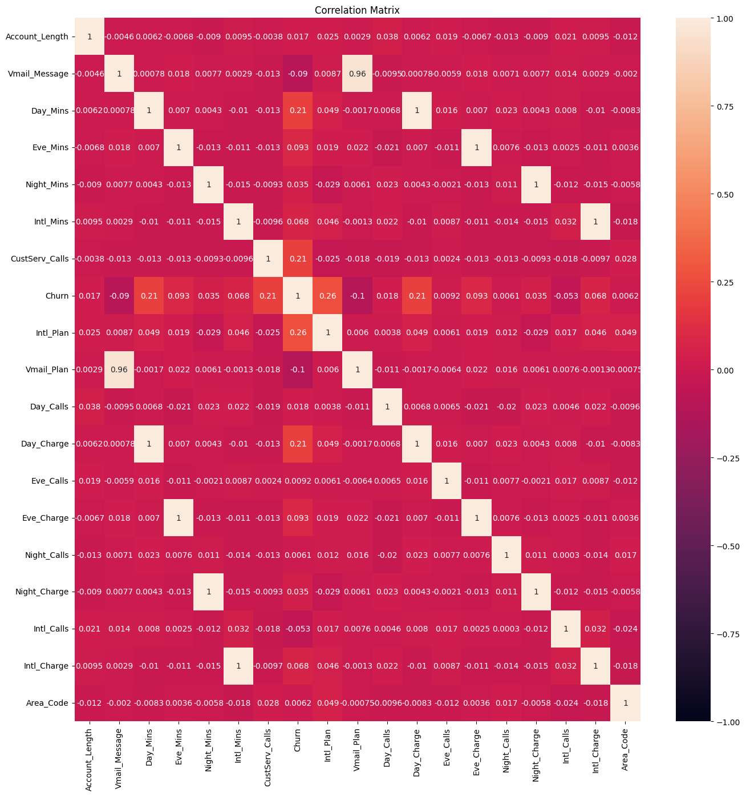
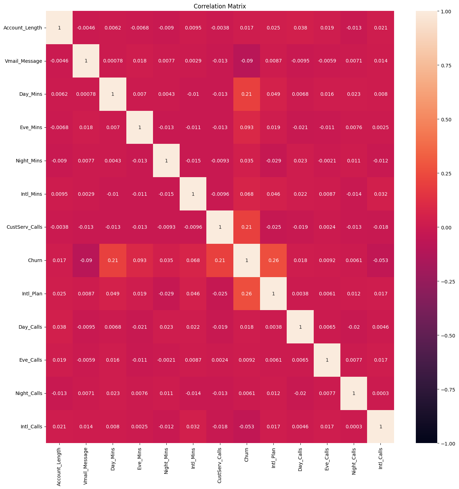
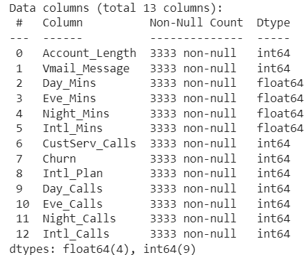
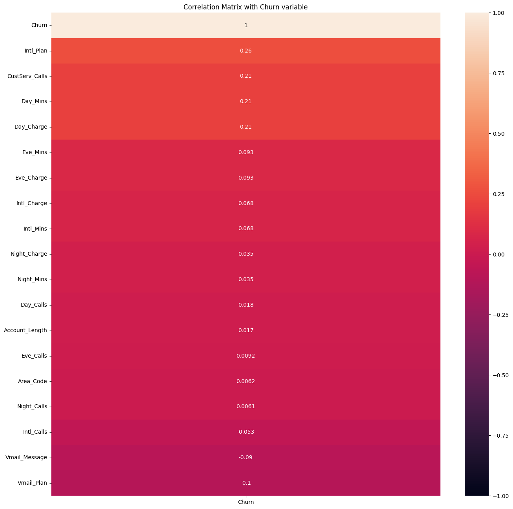

# Reporte de Datos

Este documento contiene los resultados del análisis exploratorio de datos.

## Resumen general de los datos

- Los datos cuentan con 21 columnas y con 3333 registros.
- No hay datos nulos
- Hay 5 variables categoricas-texto, y 16 númericas
- Hay 2850 registros de la clase negativa y 483 de la clase positiva
- El churn esta mayormente correlacionado con las variables que indican si tiene un plan de voz internacional, llamadas de servicio al cliente y Minutos de día
- 'Vmail_Plan', 'Day_Charge', 'Eve_Charge', 'Night_Charge', 'Intl_Charge' son variables fuertemente correlacionadas con las columnas 'Vmail_Message', 'Day_Mins', 'Eve_Mins', 'Night_Mins', 'Intl_Mins' respectivamente. Por lo tanto se descartan 
- Las columnas ['Area_Code', 'State', 'Phone'] son identificadores de cada registro, no aportan información de interes.
- Es necesario reescalar los datos por la diferencia de magnitudes.

## Resumen de calidad de los datos

No hay datos duplicados, ni datos vacios:

## Variable objetivo

La variable objetivo 'Churn' esta fuertemente desbalanceada

La variable objetivo es positiva mayormente positiva en los casos donde la linea tiene plan de voz internacional habilitado:

|Intl\_Plan|Churn|Phone|
|---|---|---|
|no|no|2664|
|no|yes|346|
|yes|no|186|
|yes|yes|137|

## Variables individuales

Un vistazo general de las variables independientes: 

|index|Account\_Length|Vmail\_Message|Day\_Mins|Eve\_Mins|Night\_Mins|Intl\_Mins|CustServ\_Calls|Day\_Calls|Day\_Charge|Eve\_Calls|Eve\_Charge|Night\_Calls|Night\_Charge|Intl\_Calls|Intl\_Charge|Area\_Code|
|---|---|---|---|---|---|---|---|---|---|---|---|---|---|---|---|---|
|count|3333\.0|3333\.0|3333\.0|3333\.0|3333\.0|3333\.0|3333\.0|3333\.0|3333\.0|3333\.0|3333\.0|3333\.0|3333\.0|3333\.0|3333\.0|3333\.0|
|mean|101\.06480648064806|8\.099009900990099|179\.77509750975094|200\.98034803480348|200\.87203720372037|10\.237293729372938|1\.5628562856285628|100\.43564356435644|30\.562307230723075|100\.11431143114311|17\.083540354035403|100\.10771077107711|9\.03932493249325|4\.4794479447944795|2\.7645814581458144|437\.18241824182417|
|std|39\.822105928595604|13\.688365372038598|54\.46738920237137|50\.713844425812|50\.57384701365836|2\.791839548408416|1\.3154910448664767|20\.069084207300897|9\.2594345539305|19\.922625293943103|4\.310667643110341|19\.568609346058558|2\.275872837660029|2\.461214270546094|0\.753772612663046|42\.371290485606615|
|min|1\.0|0\.0|0\.0|0\.0|23\.2|0\.0|0\.0|0\.0|0\.0|0\.0|0\.0|33\.0|1\.04|0\.0|0\.0|408\.0|
|25%|74\.0|0\.0|143\.7|166\.6|167\.0|8\.5|1\.0|87\.0|24\.43|87\.0|14\.16|87\.0|7\.52|3\.0|2\.3|408\.0|
|50%|101\.0|0\.0|179\.4|201\.4|201\.2|10\.3|1\.0|101\.0|30\.5|100\.0|17\.12|100\.0|9\.05|4\.0|2\.78|415\.0|
|75%|127\.0|20\.0|216\.4|235\.3|235\.3|12\.1|2\.0|114\.0|36\.79|114\.0|20\.0|113\.0|10\.59|6\.0|3\.27|510\.0|
|max|243\.0|51\.0|350\.8|363\.7|395\.0|20\.0|9\.0|165\.0|59\.64|170\.0|30\.91|175\.0|17\.77|20\.0|5\.4|510\.0|

-Se evidencia multiples escalas de diferente magnitud entre los datos.
- La media de los Minutos se mantiene en Dia, tarde y noche pero no cuando son llamadas internacionales
- Vemos que la variable Night_Mins es la que tiene el valor más alto en escala que el resto de los datos
- Vemos que la variable Day_Mins tiene una desviación estandar elevada mas que otras variables respecto a su media.

### Fuerte correlación entre variables:

Se puede ver la fuerte correlación de las variables: 'Vmail_Plan', 'Day_Charge', 'Eve_Charge', 'Night_Charge', 'Intl_Charge'. Por lo tanto se excluyen del dataset (Esto puede deberse a que son variables resultantes de aplicar una formula a otra columna existente dentro del dataset)

Al eliminar las variables se obtiene esta nueva matriz de correlación:

### Tipado de varibles
'Churn', 'Intl_Plan', 'Vmail_Plan' se convierten a valores númericos binarios

### Datos de Entrenamiento y prueba

Se dividen los datos en 80/20 para entrenamiento y pruebas

X_train, X_test, y_train, y_test = train_test_split(X, y, test_size = 0.2, random_state = 42)

### Datos reescalados

Los datos manejan diferentes magnitudes entre ellos, por ejemplo aqui se puede apreciar en los datos seleccionados para pruebas:
|index|Account\_Length|Vmail\_Message|Day\_Mins|Eve\_Mins|Night\_Mins|Intl\_Mins|CustServ\_Calls|Intl\_Plan|Day\_Calls|Eve\_Calls|Night\_Calls|Intl\_Calls|
|---|---|---|---|---|---|---|---|---|---|---|---|---|
|count|667\.0|667\.0|667\.0|667\.0|667\.0|667\.0|667\.0|667\.0|667\.0|667\.0|667\.0|667\.0|
|mean|102\.55622188905548|8\.569715142428786|180\.4721139430285|202\.10689655172413|202\.23988005997|10\.236281859070465|1\.5217391304347827|0\.09895052473763119|100\.00749625187406|100\.71814092953524|100\.89055472263868|4\.5967016491754125|
|std|40\.99477447252019|13\.851936272858136|54\.96563629352582|50\.81842711998023|50\.03923474434243|2\.773459039459444|1\.219483215639424|0\.2988196634129299|20\.79273386449388|19\.272154308063296|19\.65777056753422|2\.5357837673502517|
|min|1\.0|0\.0|0\.0|31\.2|43\.7|0\.0|0\.0|0\.0|0\.0|48\.0|36\.0|0\.0|
|25%|76\.0|0\.0|146\.8|168\.2|168\.45|8\.4|1\.0|0\.0|86\.5|87\.5|88\.0|3\.0|
|50%|103\.0|0\.0|181\.3|203\.7|202\.2|10\.3|1\.0|0\.0|101\.0|101\.0|101\.0|4\.0|
|75%|129\.0|21\.0|216\.85|237\.75|234\.95|12\.2|2\.0|0\.0|114\.0|114\.0|114\.0|6\.0|
|max|225\.0|46\.0|335\.5|341\.3|367\.7|18\.9|7\.0|1\.0|158\.0|164\.0|166\.0|20\.0|

Se aplica un Standard Scaler de sklearn para los datos de entrenamiento y pruebas:

scaler = StandardScaler()
X_train = scaler.fit_transform(X_train)
print(X_train)
X_test = scaler.fit_transform(X_test)
print(X_test)

Dando como resultado los siguientes valores reescalados y con mejor margen para que nuestro modelo generalice facilmente:

|index|Account\_Length|Vmail\_Message|Day\_Mins|Eve\_Mins|Night\_Mins|Intl\_Mins|CustServ\_Calls|Intl\_Plan|Day\_Calls|Eve\_Calls|Night\_Calls|Intl\_Calls|
|---|---|---|---|---|---|---|---|---|---|---|---|---|
|count|667\.0|667\.0|667\.0|667\.0|667\.0|667\.0|667\.0|667\.0|667\.0|667\.0|667\.0|667\.0|
|mean|-1\.597922194363044e-16|9\.587533166178264e-17|-6\.65800914317935e-17|6\.65800914317935e-17|1\.7843464503720657e-16|9\.587533166178264e-17|-9\.054892434723916e-17|3\.99480548590761e-17|1\.824294505231142e-16|-3\.056026196719321e-16|-1\.2517057189177177e-16|-6\.65800914317935e-17|
|std|1\.000750469148779|1\.0007504691487792|1\.000750469148779|1\.000750469148779|1\.000750469148779|1\.0007504691487792|1\.000750469148779|1\.000750469148779|1\.0007504691487792|1\.000750469148779|1\.000750469148779|1\.0007504691487792|
|min|-2\.479155892626669|-0\.6191297938658107|-3\.2858266523520756|-3\.3656129596670277|-3\.170689163401816|-3\.6935695559435726|-1\.2487922172066603|-0\.33138643863895567|-4\.81334246110661|-2\.7375094358709284|-3\.303490233488408|-1\.814094478866451|
|25%|-0\.6482814421166286|-0\.6191297938658107|-0\.6130627442529213|-0\.6677172937958935|-0\.6757744896632177|-0\.6625877309918106|-0\.42815733161371217|-0\.33138643863895567|-0\.6501133183920246|-0\.6863820476454241|-0\.6562406780540025|-0\.6301404500954894|
|50%|0\.010833360066985783|-0\.6191297938658107|0\.015073187827602209|0\.03137245903932691|-0\.000797573922314788|0\.022991491318707046|-0\.42815733161371217|-0\.33138643863895567|0\.047769023450304905|0\.014636173646836847|0\.00557171080459888|-0\.23548910717183552|
|75%|0\.6455365029104664|0\.8980414837196355|0\.6623263004497063|0\.7019078416883207|0\.654180025796636|0\.7085707136292241|0\.392477553979236|-0\.33138643863895567|0\.6734566402744624|0\.6896907571134585|0\.6673840996632003|0\.5538135786754722|
|max|2\.989055799563318|2\.7041977665594525|2\.8225677016483757|2\.741083726366831|3\.3090892277108552|3\.126139550197891|4\.495651981943976|3\.0176249942729143|2\.7911685741408414|3\.286054539677388|3\.314633655097606|6\.078932379606627|

## Ranking de variables

Se puede ver de manera descendente mediante una matriz de correlación como la variable Intl_Plan tiene mayor correlación con la variable objetivo:

