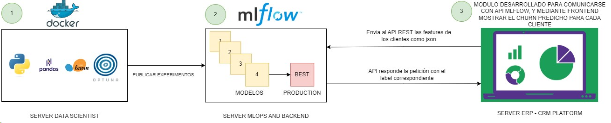
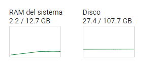
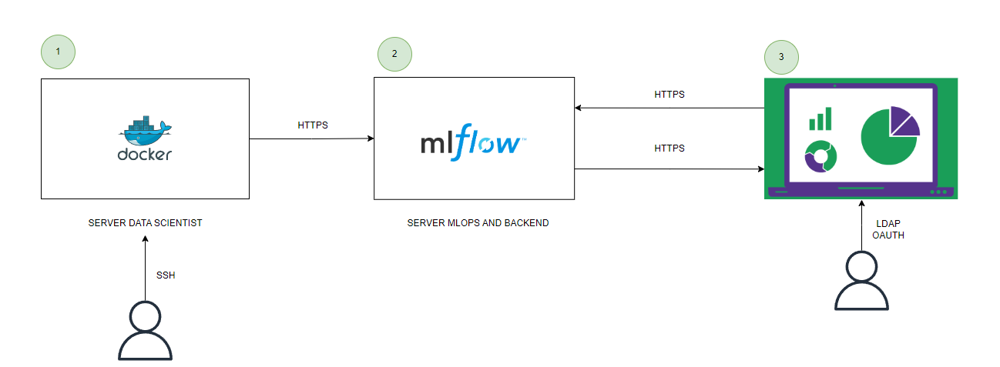
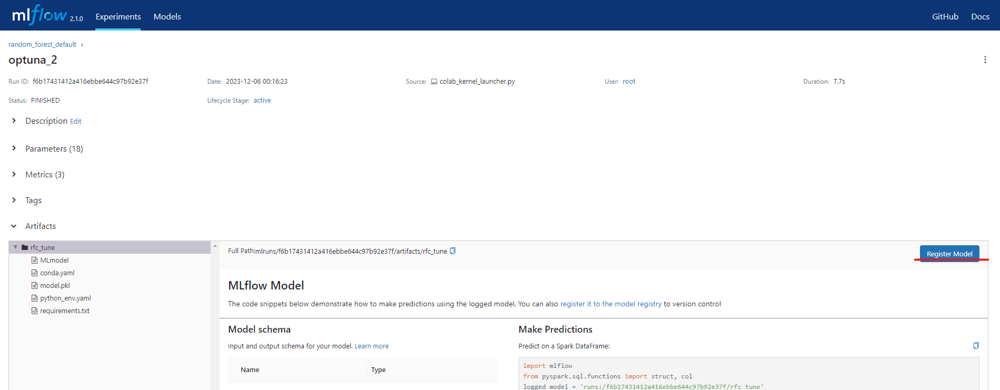
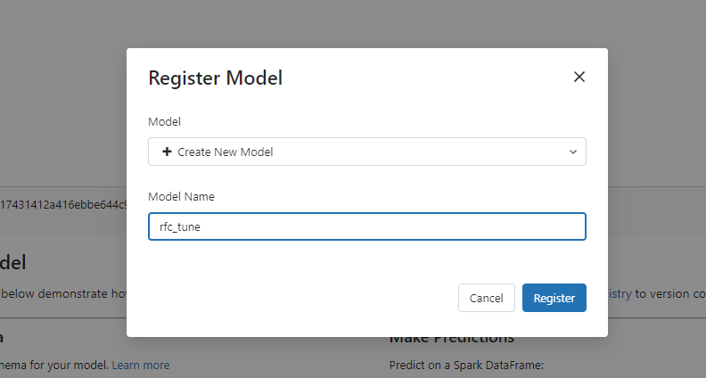
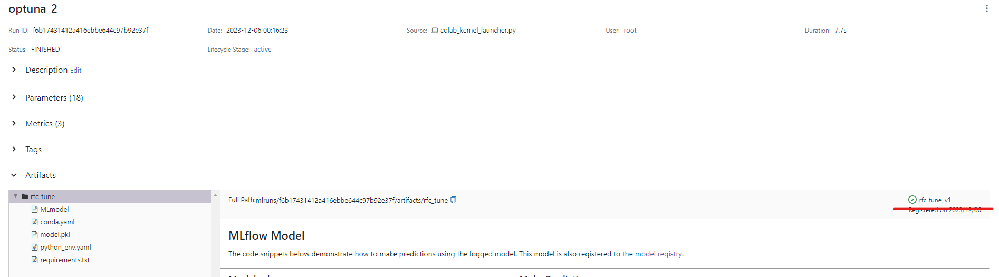
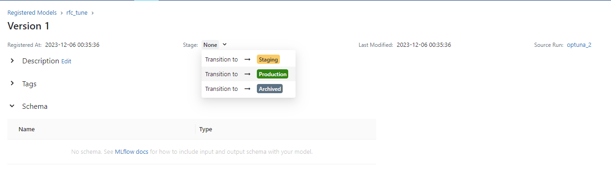

# Despliegue de modelos

## Infraestructura

- **Nombre del modelo:** rfc_tune (Random Forest Classifier con Tuning de hiperparametros)
- **Plataforma de despliegue:** El despliegue consta de 3 servidores independientes entre ellos pero montados dentro de la misma red interna.
El servidor 1, tendra un contenedor Docker con todo lo necesario para las fases de Data acquisition, preprocessing, EDA, modeling and evaluation. Este servidor se comunicará con el servidor 2, el cual será una maquina desplegada unicamente para correr la herramienta MLOps del proyecto "MLFlow". La comunicación entre ambos servidores sera atraves de la comunicación API que provee MLFlow para el tracking y model registry. 
Finalmente dentro de MLFlow se publica en producción el mejor modelo seleccionado que da solución al problema de negocio. Debido a que esta herramienta permite poder consumir el modelo mediante un API, el objetivo es que dentro del server 3 (donde se esta ejecutando el software ERP/CRM de la compañia) se implemente un nuevo modulo que realice peticiones REST a el server 2 enviando los features de cada cliente y que este le responda la etiqueta correspondiente para posteriormente ser representado en el frontend del ERP/CRM.

- **Requisitos técnicos:** (lista de requisitos técnicos necesarios para el despliegue, como versión de Python, bibliotecas de terceros, hardware, etc.)
Python 3.10 o superior, Optuna 3.4 (Y dependencias), Scikit Learn 1.2.2 (y dependencias), Libreria  MLFlow 2.1.0, Pandas 1.5.3 y Numpy 1.23.5
Hardware: Todo se testeo sobre una maquina Linux Ubuntu 22.04 de 12.7GB de ram (Se ocuparon solo 2.1 GB) y un espacio en disco de 107GB. Por la naturaleza del modelo seleccionado no es necesario el uso de la GPU.

- **Requisitos de seguridad:** La comunicación entre MLFlow y el ERP/CRM deberá ser sobre encriptación SSL. Por la naturaleza del API sera https. 
El ERP/CRM contará con su propio sistema de gestión de de acceso para cada usuario(Sea LDAP, OAUTH o su propia base de datos), el acceso al servidor Docker solo se podra hacer mediante SSH con llave idrsa privada. 

- **Diagrama de arquitectura:**

## Código de despliegue

- **Archivo principal:** training  and evaluation
- **Rutas de acceso a los archivos:** /scripts/training y /scripts/evaluation
- **Variables de entorno:**
"MLFLOW_TRACKING_URI" = "http://{domain_y/o_ip_mlflow_server}:5000"

## Documentación del despliegue

- **Instrucciones de instalación:** 
1. Se debe ejecutar todo el proceso del file training
2. El modelo se registra en MLFlow con los respectivos experimentos
3. Se debe escoger en MLFlow el modelo con la mejor metrica de desempeño f1 score
4. Se registra el modelo en MLFlow
5. El modelo se debe pasar de staging a producción
6. Se configura MLFlow para que se pueda consumir el modelo mediante API REST 
- **Instrucciones de configuración:** 
1. Registrar el modelo en MLFlow el cual obtuvo el mejor f1 score:

2. Asignar el nombre rfc_tune

3. Click en el modelo creado

4. Cambiar el stage a producción:

5. Levantar el servicio de API Rest en la maquina de MLFlow para el modelo puesto en producción (Puerto diferente al definido para la UI y registro de modelos):
**mlflow models serve -m 'models:/rfc_tune/Production' -p 8124 --env-manager 'local' &**
6. Finalmente podremos hacer uso del modelo puesto en producción.

- **Instrucciones de uso:** 
1. Debera conocer la URL o IP del servidor 2 (MLFlow) donde configuró la API REST para el modelo ademas del puerto definido en el paso de configuración (Recuerde que no es el mismo puerto de la UI)
2. Debera realizar una petición post a la siguiente URL: http://{domain_y/o_ip_mlflow_server}:8124/invocations y en el payload json de la petición debera enviar un diccionario que contendra la llave 'inputs' allí debera asignar una lista que contendran 1 o mas listas (Dependiendo la cantidad de clientes que quiera predecir) con sus respectivas features. Por ejemplo:

curl -X POST -H "Content-Type: application/json" -d '{"inputs": data_request}' http://{domain_y/o_ip_mlflow_server}:8124/invocations
Donde el valor de data_request puede ser: [[3.601381662065445,
  -0.584935532922293,
  -1.5476529221334174,
  -0.7299871432508589,
  1.2558035395167784,
  -1.3007906138024043,
  0.31897761002330555,
  -0.3266240515743332,
  -0.4296567932454234,
  -1.8408912088049738,
  0.9256335994458792,
  0.6348485573724065],
 [0.18495105432263856,
  -0.584935532922293,
  -1.244013720966101,
  -0.1380816735819312,
  0.16508986969232622,
  -2.1947932578306815,
  1.8135194524172118,
  -0.3266240515743332,
  0.22417614376006004,
  0.4998636849042407,
  -0.35370363388816944,
  -0.1843703458003117]]

- **Instrucciones de mantenimiento:** 
1. Recuerde monitorear el servicio de MLFlow con el modelo en producción. Para ello puede hacer uso de herramientas de monitoreo con Pandora FMS: https://pandorafms.com/
2. Valide metricas de desempeño del modelo una vez puesto en producción. Como la tasa de aciertos vs desaciertos para calcular metricas mas complejas
3. Siempre ejecute metódologias para monitorear el drift de los datos. Apoyandose en herramientas como evidently. 