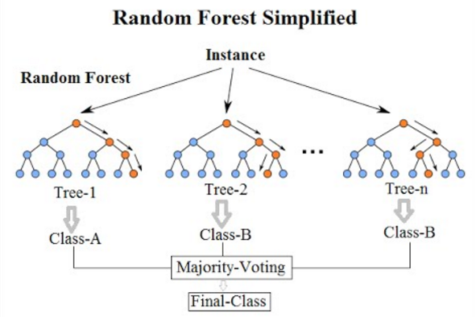
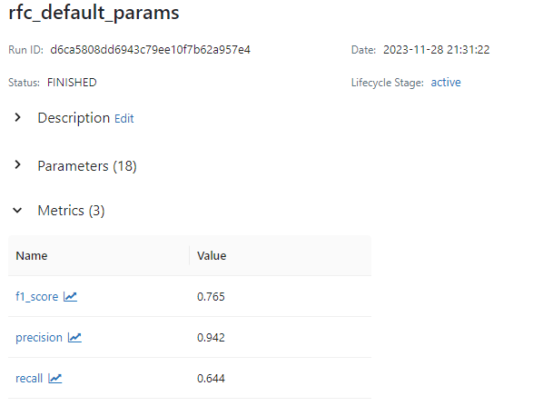
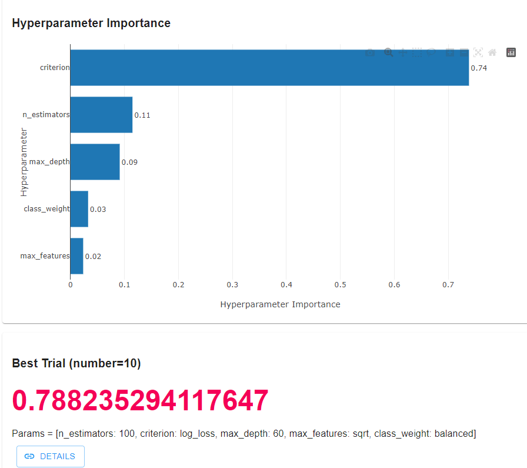
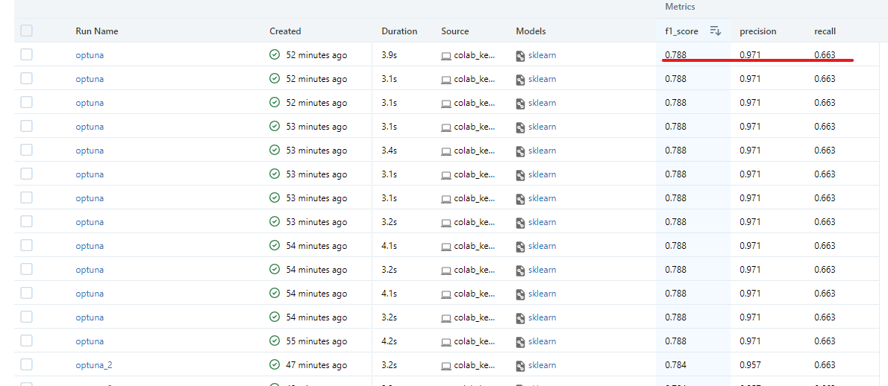

# Reporte del Modelo Baseline

Este documento contiene los resultados del modelo baseline.

## Descripción del modelo

Se establece un modelo Random Forest Classifier debido a: 
- Robustez frente al Overfitting:
Random Forest reduce el riesgo de sobreajuste (overfitting), ya que combina múltiples árboles de decisión. Cada árbol se entrena en una submuestra aleatoria de los datos y utiliza un subconjunto aleatorio de características en cada nodo de división, lo que aumenta la diversidad y mejora la generalización del modelo.

- Manejo de No Linealidades y Interacciones:
Los Random Forest pueden capturar relaciones no lineales y complejas entre las características, así como las interacciones entre ellas. Esto es crucial en problemas de churn, donde los motivos para abandonar pueden ser multifacéticos y complejos.
- Importancia de Características:
Random Forest proporciona una medida de la importancia de cada característica en el proceso de toma de decisiones. Esto es útil para comprender qué aspectos específicos tienen un mayor impacto en la predicción de churn.

- Manejo de Conjuntos de Datos Desbalanceados:
En problemas de churn, es común que la clase positiva (clientes que abandonan) sea significativamente más pequeña que la clase negativa (clientes que no abandonan). Random Forest puede manejar conjuntos de datos desbalanceados y proporcionar predicciones más equilibradas.

- Facilidad de Uso y Implementación:
Random Forest es relativamente fácil de configurar y no requiere ajustes finos intensivos como algunos otros algoritmos. Además, es eficiente en términos de tiempo de entrenamiento y puede manejar grandes conjuntos de datos de manera efectiva.

#### Se escogen los hiperparametros: 

- n_estimators:
Razón: Afecta la capacidad de generalización. Demasiado bajo = modelo débil. Demasiado alto = más tiempo sin mejora significativa.
Valores: Se prueba entre 100 y 500 ya que 100 es el valor por defecto que ofrece sklearn y se selecciona 500 ya que no queremos un valor muy alto que no genere mejoras significativas
- criterion:
Razón: gini, entropy o log_loss impacta en cómo evalúa la calidad de las divisiones. La elección depende de la naturaleza del conjunto de datos.
Valores: Se evaluan los 3 ya que aunque gini es muy utilizado se quiere explorar los resultados que se pueden alcanzar con las otras dos alternativas 

- max_depth:
Razón: Controla la profundidad máxima de cada árbol. Óptimo para evitar modelos demasiado simples o complejos.
Valores: Aunque el valor por defecto es None, se quiere validar cuanto es la profundidad minima que requiere el arbol para ser optimo para ello se deja un limite de 20 a 100 (Un arbol muy simple vs uno complejo)

- max_features:
Razón: Determina la cantidad de características para cada división. Equilibrio necesario para evitar redundancia y mejorar la diversidad del bosque.
Valores: Se prueban las operaciones raiz o logaritmo sobre el numero de caracteristicas para asi definir una partición de los datos con 2 metricas distintas y lograr evitar la redundancia.

- random_state:
Razón: Establece la semilla para la aleatorización. Esencial para la reproducibilidad y comparación de modelos.

- class_weight:
Razón: Asigna pesos a las clases, crucial en problemas desequilibrados. Ajuste adecuado mejora la predicción de la clase minoritaria.
Valores: Se prueba con “balanced” y “balanced_subsample” para hacer un analisis inversamente proporcional sobre los pesos que tiene la clase minoritaria vs la clase mayoritaria. Ademas en el analisis exploratorio se encontró que manejamos un dataset desbalanceado.

## Variables de entrada

'Account_Length', 'Vmail_Message', 'Day_Mins', 'Eve_Mins', 'Night_Mins','Intl_Mins', 'CustServ_Calls', 'Intl_Plan', 'Day_Calls', 'Eve_Calls','Night_Calls', 'Intl_Calls'

## Variable objetivo
churn

## Evaluación del modelo

### Métricas de evaluación

- Precision:

Importancia: Mide la proporción de predicciones positivas que son correctas. Importante cuando los falsos positivos son costosos o problemáticos.

- Recall:

Importancia: Mide la proporción de casos positivos reales que fueron capturados por el modelo. Crucial cuando los falsos negativos son costosos o críticos.

- F1 Score:

Importancia: Combina precision y recall en un solo número, útil cuando se busca un equilibrio entre ambos. Es especialmente útil en problemas desequilibrados.

Se busca optimizar el F1 Score para obtener un balance  en los verdaderos negativos y verdaderos positivos. Esto debido a que es importante que la empresa detecte un posible churn y tambien que no pase por alto un churn como clase negativa.

### Resultados de evaluación

- Resultados obtenidos para un RandomForest con hiperparametros default:

- Despues de ejecutar 50 iteraciones para encontrar los mejores hiperparametros, se encuentra que la importancia y los mejores valores para los hiperparametros son:

- El mayor F1 SCORE fue de 78.8% con un recall de 66% y precision de 97.1%

Aunque se hicieron > 50 iteraciones, Desde la iteración #10 se pudo encontar los mejores hiperparametros como se ve en el siguiente output:

Trial 51 finished with value: 0.7393939393939394 and parameters: {'n_estimators': 100, 'criterion': 'gini', 'max_depth': 50, 'max_features': 'log2', 'class_weight': 'balanced'}. Best is trial 10 with value: 0.788235294117647.

## Análisis de los resultados

- El modelo es preciso en un 97% para predecir que un cliente cometera churn. 
- Sin embargo solo con un 66% de efectividad puede asegurar que un cliente no cometera churn
- Se ejecutaron mas de 50 iteraciones sin embargo desde la 10 iteración no obtuvo el mayor valor de la metrica objetivo.
- Los mejores hiperparametros fueron: [n_estimators: 100, criterion: log_loss, max_depth: 60, max_features: sqrt, class_weight: balanced]
- Los peores hiperaparametros fueron: [n_estimators 150, criterion gini, max_depth 30, max_features sqrt, class_weight balanced]

## Conclusiones

- Se puede ver que aunque el modelo puede tender a confundir la clase negativa como positiva, el objetivo es clasificar aquellos clientes que si cometeran churn y en este caso 
el modelo logra realizarlo. Sin embargo se puede hacer un balance de clases mas a fondo para mejorar la metrica del recall.
- Aunque se ejecutaron 50 iteraciones estas fueron inecesarias ya que se pudo apreciar que desde el intento #10 la metrica no mejoró
- Si se compara el modelo default vs al que se le hizo tunning, se puede ver un leve aumento del 2% para el f1 score, del 3% para el precision y del 2% para el recall
- Esto es un punto de partida para optimizar mejor el modelo o explorar un modelo alternativo.
- Las diferencias entre los hiperparametros con mejor desempeño vs el de mayor desempeño son: 50 estimadores menos, 30 niveles de profundidad adicionales y un criterion log_loss, de resto los demas hiperparametros son iguales.

## Referencias

https://scikit-learn.org/stable/modules/generated/sklearn.ensemble.RandomForestClassifier.html
https://www.datacamp.com/tutorial/random-forests-classifier-python
https://colab.research.google.com/drive/1AB4nP2PAHYW6dW8tiXTjz5AFiuMGBlJi#scrollTo=917f7b38
